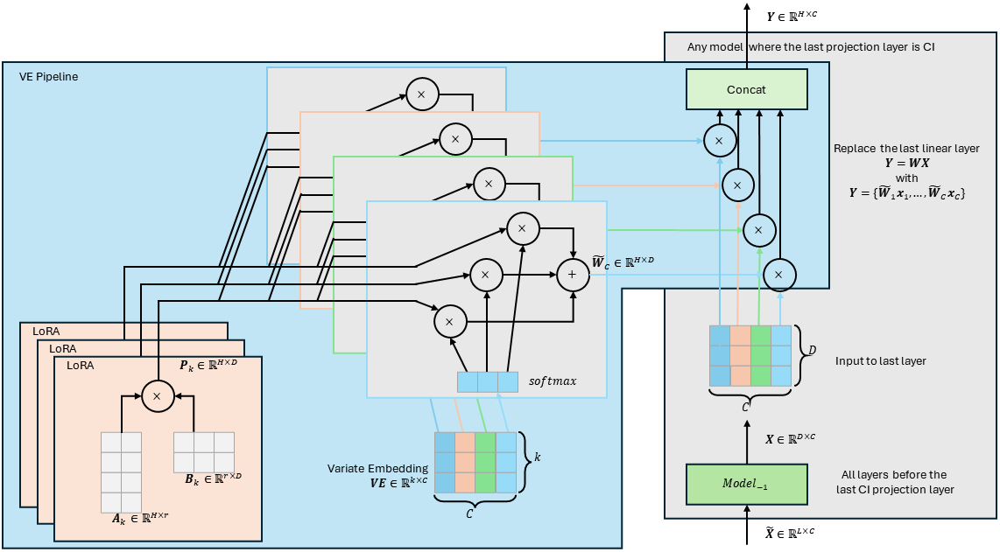
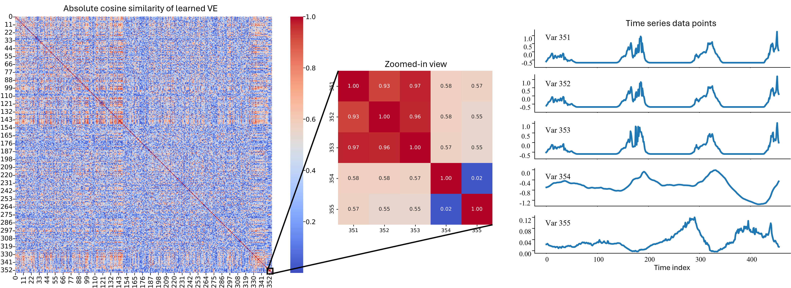
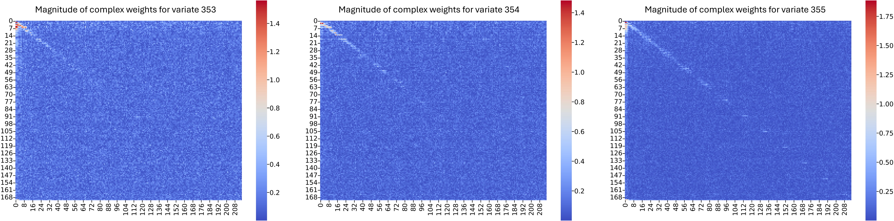
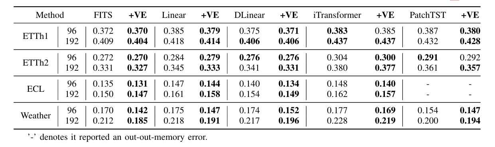
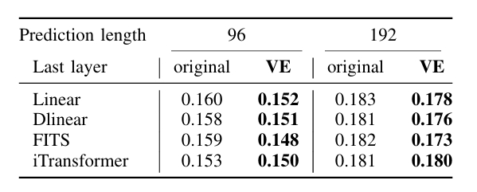

# VE: Modeling Multivariate Time Series Correlation with Variate Embedding

This repository contains the official PyTorch implementation of the VE: [VE: Modeling Multivariate Time Series Correlation with Variate Embedding](https://arxiv.org/abs/2409.06169).

Below is an overview of our VE Pipeline architecture:



The VE pipeline can be integrated into any model with a channel-independent (CI) final projection layer to improve multivariate forecasting. 
The learned VE effectively groups variates with similar temporal patterns and separates those with low correlations. 
This is confirmed in the figure below, where the second image shows the magnitude of the learned complex-value weights of FITS:





Our VE pipeline is effective for all methods with a CI projection layer. 
Below are the MSE results of our VE on the ETTh1, ETTh2, ECL, and Weather datasets at prediction lengths $H \in {92, 192}$.



Our VE performs best when the multivariate time series data exhibit significant diversity, as demonstrated by the MSE results on the mixed dataset (ETTh1, ETTh2, ECL, and Weather combined) shown below.



The VE layer file can be found at [layers/VariateEmbedding.py](layers/VariateEmbedding.py)

## Getting Started

### 1. Environment Requirements
To get started, ensure you have PyTorch installed, then set up the environment by running:
```
pip install -r requirements.txt
```
For a detailed environment setup used in our experiments, please refer to [EnvironmentSetup.md](EnvironmentSetup.md)

### 2. Data Preparation
All four datasets can be obtained from [Google Drive]((https://drive.google.com/drive/folders/1ZOYpTUa82_jCcxIdTmyr0LXQfvaM9vIy)) provided by Autoformer.
Below is the tree structure of the dataset files:
```
VE Pipeline\dataset
│ .DS_Store
│
├─electricity
│
├─ETT-small
│
└─weather
```

### 3. Training Example

#### 1. Multivariate forecasting on each dataset
```
bash ./scripts/VE/All_VE.sh
```

#### 2. Multivariate forecasting on mixed dataset
```
bash ./scripts/VE/Mix/Mix_best.sh
```

## Citation

If you find this repository useful, please cite our paper:
```
@article{wang2024ve,
  title={VE: Modeling Multivariate Time Series Correlation with Variate Embedding},
  author={Wang, Shangjiong and Man, Zhihong and Cao, Zhenwei and Zheng, Jinchuan and Ge, Zhikang},
  journal={arXiv preprint arXiv:2409.06169},
  year={2024}
}
```
## Contact
If you have any questions or suggestions, feel free to contact:
 - Shangjiong Wang (shangjiongwang@swin.edu.au)

## Acknowledgement

We appreciate the useful code provided by the following GitHub repositories:

https://github.com/VEWOXIC/FITS

https://github.com/cure-lab/LTSF-Linear

https://github.com/thuml/iTransformer

https://github.com/yuqinie98/PatchTST

https://github.com/thuml/Time-Series-Library

